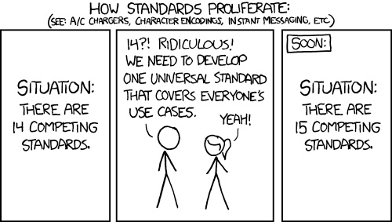

Additional Files for Understandable Multifunctionality Measures Using Hill Numbers

What you will find here:

- ms
- pdf versions of all manuscripts with a date of generation

- appendix_1.* - Files for appendix 1 in the mannuscript. The .Rmd is what was used to generate all others.  
  
- appendix_2.* - Files for appendix 2, a worked example, in the mannuscript. The .Rmd is what was used to generate all others.  
  
- original_draft - The initial draft (in various forms) generated by Jarrett and Robi in 2019  
  
- notes - various miscellany generated by Robi, Fabian, and Jarrett while working on the manuscript. Warning - not all are correct, and some are tangents and rabbit holes that we did not explore further.

- Please also see the Github issues for some long discussions between co-authors