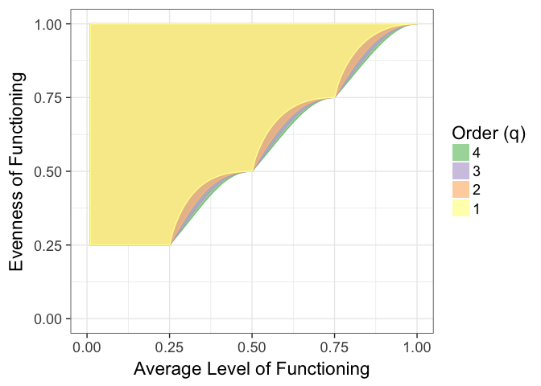

#### Introduction

The past decade has witnessed the growth of the concept of ecosystem **multifunctionality**. Multifunctionality is defined as a measure of the simultaneous performance of multiple functions. Note that we do not say "ecosystem functions", as multifunctionality is a broader concept that can be easily applied outside of community and ecosystem ecology - and even outside of ecology altogether. This concept has proven unifying in a number of different situations. <!-- In the Biodiversity Ecosystem Function literature, it has enabled researchers to realize that, while specific species often drive single functions, different species or functional groups often drive different functions enhancing diversity's importance as progressively more functions are considered [@Hooper:1998un; @Duffy:2003wt;  @Hector:2007gm; @Lefcheck:2015dg]. --> Researchers are beginning to recognize that foundation species create multifunctional landscapes [@Angelini:2015ef] that differ not only in species diversity and abundance, but ecosystem-level properties. Invasion biology has begun to use multifunctionality to quantify whole-system level changes [@Ramus:2017gn]. Multifunctionality has tremendous use to applied ecology as well. Managers often attempt to work towards the provision of multiple ecosystem services [@Nelson:2009kl, @Brandt:2014; @Binder:2018is] - fundamentally the same concept as multifunctionality - or have come to understand single ecosystem services as the sum of multiple different ecosystem functions [@Nilsson:2017gv]. Across each of these areas, we see that the concept of multifunctionality as a potential linchpin linking community and ecosystem ecology. 

However, adoption of multifunctionality as a fundamental concept providing this linchpin has been slow. Nor is there a robust theoretical core behind multifunctionality, further hindering its penetration into scientific thinking. We posit that there is at least one simple explanation behind this lack of progress. While some researchers and managers have latched on to the concept of multifunctionality, the field still lacks a clear single metric that it can use to summarize the phenomenon. Frankly, current metrics range from the simple yet misstated to the complex and accurate yet unweildy. We acknowledge some of our own blame in this state of affairs [@Byrnes:2014fv]; although we do note that throwing even some of the finest minds against this problem in a stimulating working group format over multiple years (we are thankful for NCEAS for providing this venue) has likely resulted in more ink impregnated on foreheads hitting whiteboards than should be typical. We are similarly thankful that many in the field have continued to be critical and force us to look at our current failures with honesty [@Roger:2016bt].

# FABIAN TALK ABOUT LARGER FRAMEWORK AND APPLICATION TO LANDSCAPE MULTIFUNC

Here we briefly review the current state of affairs, propose a solution, and discuss some of the ongoing challenges to the field, including whole conceptual fields of exploration that we feel have been entirely missed.

#### The current state of multifunctional affairs

The definition of multifunctionality presents a challenge. How to we define a metric that captures both the level of performance of a broad suite of functions as well as the distribution of differences in performance between functions? Researchers have sought to capture this question in four ways, after standardizing functions to similar levels in order to prevent apples-to-oranges comparisons.

First, on the side of simplicty, taking the average of all functions [e.g., @Maestre:2012fw]. This approach appears on its face appealing, particularly as it provides a metric that can be put on a y-axis while a predictor is on the x. However, it sacrifices crucial information about the system. An arithmetic mean tells us, were we to sample any one function, what level of functioning would we expect? Consider two plots - one where all functions are similar and performing at half their value and one where half of the functions are at their maximum while half are absent. The averaging approach says that they are identical. Geometric averaging appears to get around this problem to some degree, as a geometric mean is approximately the arithmetic mean minus the variance of observations. However, given its formulation, one critically low function can bias the measurement, nor do we always have a sufficient sample of functions to achieve that approximation.

Second, we have metrics of the Multivariate Diversity Interactions framework [@Dooley:2015em]. This elegant framework allows us to tease apart the importance of correlations between functions and the contribution of different drivers to simultaneous change in those functions. It does not, however, provide a holistic metric of multifunctionality *per se*, much like the overlap approach before it [@Hector:2007gm] which is really a generalization of Sørenson overlap to provides key information on redundancy versus unique contributions of species. While we gain rich information about a system, we do not gain holistic interpretability.

Last, we have the multiple threshold approach. This approach seeks to balance the goals of measuring the simultaneous performance of multiple ecosystem functions with the arbitrariness of choosing a threshold of relevance for those functions. We note that many who use it simply choose a single threshold, although present many in their appendicies [e.g., @Hensel:wd]. This is a reasonable choice in order to understand a single set of observations. Further, for those who do look at all thresholds, the results are, frankly, difficult to interpret as the quantities they yeild are non-obvious in their links to the concept of multifunctionality. The approach yields rich information about multifunctionality *sensu stricto*, but in so doing, becomes unweildy for most if not all who choose to use it. Related, more recent efforts have sought to use dimensionality-reducing techniques which has yielded metrics that while useful lack interpretable meaning [@Meyer:2017gj].

# FABIAN ONE PARAGRAPH ON SPATIAL AND ITS NASCENT BEGINNINGS

How can we solve this? What is a good metric of multifunctionality that yields the information we need in a proper holistic fashion such that we might even ultimately link it back to theory?

#### A Way Forward

The definition of multifunctionality presents a challenge. How do we define a metric that captures both the level of performance of a broad suite of functions as well as the distribution of differences in performance between functions? The issue of total level of performance is easily linked to thinking about total community size. In our case, a simple averaging across functions should suffice and addresses the level of performance across the whole community of functions. This leaves open the question of how this average is distributed across functions.  
  
This problem of assessing the distribution of differences across functions seems akin to the problem of capturing diversity of species within a community. We know the "richness" of functions - it is the total number of functions we are observing. This richness can be partitioned independently into evenness and a measure of compositional complexity [@Jost:2010jo]. In the diversity literature, this metric of complexity can be simply translated into an effective number of species, i.e., the number of equally abundant species that would produce the same metric [@Jost:2006fr; @Jost:2010jo], via Hill Numbers. This translates beautifully to the concept of measuring the **effective number of functions** provided by an area as a measure of multifunctionality. For some set of functions that have been standardized to a common scale (i.e., between 0 and 1) and defining $F_{1,2,3...S}$ as their level of function

$$
\tag{eq. 1}
p_i = \frac{F_i}{\sum F_i}
$$

$$
\tag{eq. 2}
^{q}N = \left(\sum_{i=1}^{S}p_{i}^q\right)^{1/(1-q)}
$$

where $N_q$ is the effective number of functions for some order q. Adapting from Jost (2006), if q = 0, this is the total number of functions, S. If q<1, then functions at low level dominate the calculation. For q = 1, the approximation of this function is equivalent to results from Shannon diversity for species, $^{1}N = exp(-\sum{p_i\;log \;p_i})$. For q>1, functions performing at higher levels are given greater weight. At q = 2, we get results that are equivalent to the number of functions calculated from Simpson's diversity. If one of our goals is to up-weight high performing functions, q=2 is a reasonable choice. However, to be conservative, q=1 is sufficient, and provides a strong tool for both ecologists and managers.

Effective number of functions does not accomodate knowledge about the absolute level of functioning in a system - a true metric of multifunctionality. To achieve this translation, we need to use this effective number of functions to first calculate functional evenness. This is simply the effective number of functions divided by the number of functions divided we are observing [@Jost:2010jo]. 

$$
\tag{eq. 3}
^{q}E = \frac{^{q}N}{S}
$$

Armed with functional evenness, effective number of functions, and average level of function, discussed previously and here defined as $A$, we can turn to creating a meaningful multifunctionality metric that simultaneously captures level of function and evenness of function.

$$
\tag{eq. 4}
M_e = E\, A
$$

This metric can also be rescaled back to units of number of functions by multiplying it by total number of functions providing an metric on the scale of the absolute number of functions, such that $M_f = M_e S$.

Why must we consider level of function and evenness together in one metric? First, both the average and evenness (or effective number of functions) are non-independent, with the upper limit of $^{q}E = 1$ and the lower limit is set by a combination of the produce of AS and $\lfloor AS \rfloor$ (Figure 1) with an absolute lower limit to evenness set at 1/S which is maintained until the $MF_A$ reaches 1/S. See [Appendix 1](#Appendix1) and [Appendix 2](#Appendix2) for discussion and derivations. 

More importantly, a combined metric satisfies our definition of multfunctionality. High numbers imply both high level of function and high evenness. Low number imply that, even if a single function is being optimized, the assemblage of functions as a whole is not performing well. The relationship can also be easily decomposed into its constiuent parts for a more mechanistic examination of its behavior.

Last, from a convenience standpoint, having this single metric now allows us to begin to examine it as any other response variable. In the BEF world, we might look at additive partioning in addition to complementary overlap approaches. In global change biology, we can look at stability, resistance, and resilience. The options are open.

#### Extending the Framework to Landscape Multifunctionality
#FABIAN

#### Application to real data

##### Biodiversity and Ecosystem Multifunctionality

To see how this metric can be used, consider the example of Duffy et al. 2003. In this experiment, Duffy and colleagues sought to examine how biodiversity of grazers influences multiple different ecosystem functions in seagrass ecosystems. Using the functions discussed in the paper, we standardized and reflected them as per how Duffy et al. discuss their results. We then compare average functional performance, functional evenness with q=1, and our new multifunctionality metric (Figure 2).

![<b>Figure 2.</b> Three ways of looking at multifunctionality in Duffy et al. 2003. based on Periphyton biomass (wall chlorophyll a), total algal mass, grazer mass, <i>Zostera</i> final mass, sessile invertebrate mass, and sediment carbon. Colors denote different species combinations. Points are jittered horizontally to reveal overlapping data points.A) Average level of standardized functions. B) Multifunctional evenness calculated at q=1 (i.e., using Shannon Effective Number of Species). C) Multifunctionality, as defined by the product of evenness and average function.](multifunc_new_files/figure-html/duffy-1.png)

<table class="table table-striped table-hover" style="margin-left: auto; margin-right: auto;">
 <thead>
  <tr>
   <th style="text-align:left;"> Index </th>
   <th style="text-align:left;"> Predictor </th>
   <th style="text-align:right;"> Slope Estimate </th>
   <th style="text-align:right;"> SE </th>
  </tr>
 </thead>
<tbody>
  <tr>
   <td style="text-align:left;"> Average Function </td>
   <td style="text-align:left;"> Richness </td>
   <td style="text-align:right;"> 0.0261 </td>
   <td style="text-align:right;"> 0.0080 </td>
  </tr>
  <tr>
   <td style="text-align:left;"> Functional Evenness </td>
   <td style="text-align:left;"> Richness </td>
   <td style="text-align:right;"> 0.0130 </td>
   <td style="text-align:right;"> 0.0064 </td>
  </tr>
  <tr>
   <td style="text-align:left;"> Multifunctionality </td>
   <td style="text-align:left;"> Richness </td>
   <td style="text-align:right;"> 0.0294 </td>
   <td style="text-align:right;"> 0.0092 </td>
  </tr>
</tbody>
</table>

Comparing the three, we see that MFA and our multifunctionality metric produce broadly similar results. This result is due to evenness of function being high across most of the experiment.  Thus, the slope of the multifunctionality relationship remains tied to the average (Figure 2, Table 1). Where we do see evenness making a difference is in the lower richness plots, some of which are downweighted given their low evenness, potentially making the strength of the richness-multifunctionality relationship subtly stronger (i.e., steeper slope). Our results broadly reproduce the qualitative conclusions of Duffy et al. (2003). However, they reveal that multiple species drive multifunctionality largely from driving up the average of all functions with only small, if any, effects on functional evenness.

##### Landscape Multifunctionality 
# FABIAN

##### Shiny App to Show relationships between metrics
# FABIAN?

#### Robutness of metrics and similarity to past metrics
# FABIAN DO MAGIC HERE OR WRITE A DISCUSSION OF WHY THIS SATISFIES THE CONCERNS FROM YOUR FORMER PAPER

#### A note on standardization

As pointed out in discussions of multifunctionality, how functions are standardized matters [@Manning:2018bk]. First is the choice of direction - what implies positive function? When services are being examined explicitly, this is hopefully a straightforward choice - although consider tradeoffs between nutrient cycling rates and storage as a tricky context. Further, not all functions are equally important, particularly in the case of management. Fortunately, choosing an 'optimal' level of function to link to 1 can alleviate this (e.g., if 25% of  function is sufficiently high, 25% or higher can be considered a '1'). Functions can also be upweighted or downweighted in the calculation of MFA of $^qN$ (constrained to ensure $\sum p_i = 1$). These choices should be simple to justify with sufficient system-specific context.

#### A note on correlated functions

A great deal of the confusion in the multifunctionality literature even when using metrics has sprung from the issue of correlation between functions [@Bradford:2014hd; @Byrnes:2014kv; @Bradford:2014cr]. In no small part this is likely due to the incessant focus on accounting for correlation in areas such as spatial and temporal analysis. To have correlations between functions seems to somehow either "contaminate" results and make them suspect or, for others, only correlated functions are valid to indicate multifunctionality [@@Bradford:2014hd]. Neither of these are strictly true. 

The difficulty comes down to defining just what a "function" is, as excellently discussed by Manning and colleagues [@Manning:2018bk]. This semantic argument has led down the path of considering "true" functions as the single response to a driver that gives rise to all other responses. Consider the example of aboveground and belowground production in plants. The two are driven by similar, if not mutually overlapping, biological processes. Thus, are they truly separate functions? If biological reductionism in functional space is the goal of a researcher, then dimensional reduction techniques before analysis would seem to be in order. We offer a caution, however, that techniques such as PCA reduce dimensions with no basis in biology. While they are useful  in terms of compressing information and addressing the problem in creating a multifunctionality metric that can be used [Meyer:2017gj], there is no inherent meaning in their outputs. Moreover, the formulae are dependent on the data used to create the PCA, and thus difficult to generalize across studies. Manning et al. suggest cluster analysis [@Manning:2018bk] for all ecosystem function based multifunctionality analysis (as opposed to service based). This form of analysis is still based on *de novo* groups generated by the data rather than from *a priori* knowldge of the biology of the system. We suggest, rather, Confirmatory Factor Analysis [@Brown:2012vc] with a meaningful underlying factor structure might provide a far more useful and biologically meaningful option. Further, it can be tested for measurement invariance, and as such can be shown to be generalizable across studies with the same functions measured, solving problems of study specificity [@Manning:2018bk].

Must we always cluster? Managers have goals that focus on functions and services that are independent of any biological reductionism - so called ecosystem-service based multifunctionality [@Manning:2018bk]. In this case, sweeping this correlation under the rug for a single metric of multifunction is not only acceptable, but desirable in terms of defining a clear metric for management. This view need not be limited to management, however. If researchers are working with a well-defined set of functions that are representative of an ecosystem state (see below) or answering a theoretical question, then clustering is not necessary.

Further, clustering by default treats correlation between functions as if they are static. Consider, however, that if a driver increases multifunctionality, then it is pushing multiple functions to higher levels at the same time. Our results show that systems with higher average levels of function also are constrained to have higher evenness, and thus higher correlation between functions. Thus in highly multifunctional systems, functions are more highly correlated when function is low often by definition. This means that results from clustered analysis considering all treatments could produce innacurate representations of the system, as cluster structure might be dependent on treatment itself. This is a particularly pernicious problem for techniques that do not rely on *a priori* cluster definitions - but would affect CFA results as well.

If researchers are interested in exploring the correlation structure of functions - or even how that structure changes across treatments (something to our knowledge that has not been done) - then that is a separate piece of a good ecological story. To our knowledge, this has not been robustly explored, nor is there a solid body of theory addressing this phenomen of multifunctional correlation. Perhaps it is time to explore it further. Regardless, even changing correlation across levels of a driver does not invalidate any metric of multifunctionality seeking to capture simultaneous change in multiple functions. It comes down to a researchers question and how that question forces them to define functions. This is an epistomological point beyond the scope of any metric.

#### Thinking Beyond Measured Functions

One potential pitfall of this technique is to assume that it is robust to a researchers choice in what functions to measure in terms of the inferences it can deliver about a system. In an ideal world, when we quantify multifunctionality we would think of all possible functions as a population. We would then measure a random (or stratified!) sample of functions in order to draw good inferences about how a driver influences system-wide multifunctionality. To our knowledge, this type of careful thought about relevant functions from a population sampling perspective has never been applied in multifunctionality research. We hope we are wrong about this, and applaud anyone who has done so. Recently, several excellent guides to selecting standardized sets of relevant ecosystem functions have begun to appear in the literature [@Meyer:2015go; @Lefcheck:2016ho]. We suggest these as a starting point for any researchers interested in thinking carefully about the topic, in addition to fruitful discussions of with ecosystem ecologists working in the same system. They are highly likely to disabuse any community ecologist of the notion that they have fully captured a good sample of the population of relevant functions, and provide guidance on further ways to do so (J. Bowen, pers. com.).

#### Conclusions

#FABIAN ANYTHING ELSE HERE?

We hope that this piece will provide the field of multifunctionality with a way out of its current state of division and confusion. Further, we hope it provides food for additional theory that addresses the causes and consequences of ecosystem multifunctionality, something that is currently sorely lacking. We have been heartened by the idea leaving the cradle of the field of biodiversity and ecosystem function, and feel that it has the promise to provide a holistic unifying concept for anyone interested in capturing a snapshot of system dynamics in single meaningful metric.

#### Appendix 1: Upper Limit of Multifunctional Evenness is 1 {#Appendix1}
While eqn. 3 will always have a maximum upper bound of 1 at any level of averge level of functioning (i.e., all functions are performing at the same level), $^{q}E$ has a lower bound set by $A$. We can see this mathematically. We start by noting that

$$
\tag{eq. 5}
p_i = \frac{F_i}{\sum_{i=1}^S{F_i}}
$$

Substituting this in for values of $p_i$ in eqn. 2, then pulling out constants we get 

$$
\tag{eq. 6}
^{q}N = \left[{\frac{1}{A^q \cdot S^{q}}} \cdot \sum_{i=1}^{S}F_{i}^q \right]^{1/(1-q)}
$$

Given that the generalized mean for order q, which we'll call $^{q}A$ such that $^{1}A = A$ is defined as
$$
A_{q} = \left[ \frac{1}{S}\sum_{i=1}^{S}F_{i}^q\right]^{1/q} 
$$

Leading to 

$$
\sum_{i=1}^{S}F_{i}^q = A_{q}^qS
$$

Then we can substitute this into the equation 6, now denoting the arithmetic mean as $A_1$ such that

$$
\begin{aligned} 
^{q}N &= \left[A_{q}^q \cdot A_1^{-q} \cdot S^{1-q} \right]^{1/(1-q)} \\
&\Rightarrow S\left[A_{q}^q \cdot A_1^{-q} \right]^{1/(1-q)}
\end{aligned} 
$$

Assuming that $q \le 1$, the generalized mean inequality states thatfor q $\ge$ 1, $A_1 \le \ A_q$. When all functions perform leading to the same level,  $A_1 = \ A_q$, leading to $^{q}N = S$ and thus $^{q}E = 1$

#### Appendix 2: Lower Limit of Multifunctional Evenness {#Appendix2}
As the lower portion of the curve occurs at minimum evenness (i.e., maximum dominance), it is constrained at a lower bound given that we know the average of all functions. For example, for a set of functions where $0 < A  \le 1/S$, all functions save one are 0 and for the remaining function, $0 < F_S \le 1$. If $1/S < A \le 2/S$, then $F_{S-1} = 1$, $0 < F_{S-1} \le 1$, and $F_1...F_{S-2} = 0$. Thus, for any number of functions, S, and any average level of functions, A, where $0 \le F_i \le 1$, if we define $g = \lfloor AS \rfloor$

$$
\begin{aligned} 
&F_{1}...F_{S-g-1} = 0 \\
&F_{S-g} = AS - \lfloor AS \rfloor \\
&F_{S-g+1}...F_{S} = 1
\end{aligned} 
$$

Plugging this into equation 6, we get

$$
\tag{eq. 7}
^{q}N_{lower} = \left[{A^{-q} \cdot S^{-q}} (\lfloor AS \rfloor + F_{S-g}\;^q) \right]^{1/(1-q)}
$$

For q=1, we can begin by re-arranging the limit using a substition from equation 5.

$$
\begin{aligned}
&^{1}N_{lower} = exp\left(-\sum p_i \;log\; p_i\right) \\
&\Rightarrow exp\left(-\sum \frac{F_i}{AS} \;log\; \frac{F_i}{AS}\right)\\
&\Rightarrow exp\left(-\frac{1}{AS}  \sum (F_i \; log \; F_i \; - F_i\; log \; AS)\right) \\
\end{aligned}
$$

We can use the same approach as before, taking 0 log 0 = 0, to get a lower limit for q=1 as

$$
\begin{aligned}
&^{1}N_{lower} = exp\left(\lfloor AS \rfloor\frac{log AS}{AS} + \frac{log AS}{AS}(AS-\lfloor AS \rfloor) - \frac{(AS-\lfloor AS \rfloor)}{AS}(AS-\lfloor AS \rfloor) \right) \\
&\Rightarrow \frac{-AS(AS-\lfloor AS \rfloor)^\frac{(AS-\lfloor AS \rfloor)}{AS}}{(\lfloor AS \rfloor - AS)}
\end{aligned}
$$

When $AS-\lfloor AS \rfloor = 0$, this reduces to $AS ^ {\frac{\lfloor AS \rfloor}{AS}}$.

#### References
