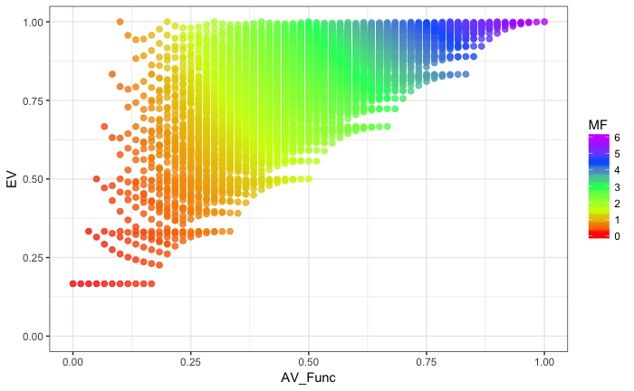

```{r setup, include=FALSE}
knitr::opts_chunk$set(echo = TRUE)
```

```{r, message=FALSE, echo = FALSE}
library(tidyverse)
library(vegan)
library(emo)
library(RColorBrewer)
library(knitr)
```

#Start of discussion: 

2017-09-25: **Jarrett** (*whadda ya think of this?*)

I don’t want to give you any explanation - just hear your raw reactions here. (FYI, F = # of functions measured).

 Making much progress.

 Thank god for Lou Jost.


```{r, out.width = "500px", echo = F}
knitr::include_graphics("pics/Jarret_20170925.tiff")
```


2017-09-25: **Robert**

 First impression is that the multifunctionality index does seem to increase nicely with both evenness and average level, which would be exactly what we want!

 Couple of follow-ups 
 1) how similar is the contribution of average level and evenness to the total effect (i.e. if you took a slice through the response parallel to one axis and then the other, would they have similar slopes and shapes?) Eyeballing it, it looks pretty good.
2) How does the slope change across the values of evenness and average level - i.e. are they linear relationships?

 Adding isoclines might make both those points clear, or marginal panels.

2017-09-26: **Fabian**

 Hej Jarrett and Robert. First: I’m excited to see that you decided to start working on this again and thanks for having me in the loop! 

 My first impression is that it looks awesome! Lou Jost: The relationship between Evenness and Diversity (diversity, 2010), am I right? :-)

 I was puzzled at first about the lower bound but in light of the paper above, it totally makes sense. To understand better I tried to reverse-engineer your approach and this is what I came up with: 

```{r, out.width = "500px", echo = F}

```

 Here, I simulate a community of 4 functions, in all possible abundance combinations (in steps of 0.1 - seq(0,1,0.1)), calculate Pielou’s evenness (EV), average MF (AV_Func) and the exponential Shannon diversity. Multifunctionality here is defined as exp(H) * AV_Func. 

 curious to see if that’s the way you did it!

 One difference is that in my case MF varies between 0 and #F not 0 and 1. To me, that makes sense as limiting MF to a maximum value of 1 means that we equate 2 functions performed at 100% with 10 functions performed at 100% or? 

 On the flip-side, if MF increases with the number of functions considered, it is sensitive to the addition of perfectly correlated functions - which is undesirable to my mind. 

 On a personal note, I am available for working on this these days. I’m waiting to here back from some post-doc applications and I finish off stuff, but this more interesting :-)

2017-09-27: **Jarrett**

 Fantastic - very similar to what I was doing. I used Simpson’s for some reasons, and using Jost 2010 did indeed standardize by number of functions to get an evenness. And then you multiply by the average level of function to create this new metric of MF. I’ll attach the straight R file. Line 53 is where I calculate mf_average and the evenness after making data for functions. You multiply them together to get MF (see further below in the conceptual figure).

 If you want to use these functions to create a MF index and then run your tests against it to look at sensitivity to # of functions, etc., that would be an awesome next step while I work on the text and explanations.

 I’m also going to rewrite this in lower level code so I can put it into multifunc. But it’s hard to go back from the tidyverse!

2017-09-27: **Jarrett** (*in response to Robert*)

*1) how similar is the contribution of average level and evenness to the total effect (i.e. if you took a slice through the response parallel to one axis and then the other, would they have similar slopes and shapes?) Eyeballing it, it looks pretty good.*

 It’s good - they’re just a product. Although thinking about it, one could say MF = average^wa * evenness^we

 where wa and we are powers that will result in a reweighing, depending on a managers goal for MF. They default to 1. But if you want to, say, upweight evenness, then we < 1. You’re still bounded at between 0 and 1. What would reasonable scenarios be for these power, though, I wonder…. 

*2) How does the slope change across the values of evenness and average level - i.e. are they linear relationships?*

 which slope?

*Adding isoclines might make both those points clear, or marginal panels.*

 Unclear what you’re asking for - some more detail, as I kinda see what you’re getting at, but not enough….

2017-09-28: **Fabian**

Hej,

I love your excitement Jarrett, at your pace, this feels like it will be published by the end of the week :-)

But before we start writing up stuff, could I make some comments on the metric? I went back and looked at the thoughts that I wrote down in my thesis (btw, Robert, if you’re interested you can find it here: https://gupea.ub.gu.se/handle/2077/52128 - multifunctionality is the second last chapter). 

Some problems that we haven’t addressed so far include:

1) which diversity to use (q = 1, q= 2 - I argue diversity profiles)
2) how to weight functions
3) how to account for strong colinearities

Yesterday I took your advice and discussed some science over some beer with a mathematician who is a friend of mine. I think it was a very fruitful discussion and I tried to sum it up for you in the HTML that is attached (rmd file is on GitHub). 

please let me know what you think!

Also, if we suggest a new MF metric I would really like to get the point across that we need a new one that *replaces* the previous ones. We should, by all means, avoid to do it xkcd style:

```{r, out.width = "300px", echo = F}
knitr::include_graphics("pics/xkcd.tiff")
```

For me, this includes making thorough comparisons between our new metric and all previous once, pointing out possible mathematic equivalences and testing the behavior of our metric thoroughly (which we can start by doing with the code I wrote for the NEE paper, as you pointed out Jarret) 

I really want to get this right :-)

looking forward the hearing your thoughts!


#looking at *diversity profiles* not only diversities (*this file*)

The approach that we take to calculate the abundance weighted functional diversity is borrowed from the framework of Hill numbers / exponential Reny entropies / effective number of types or species reintroduced by Jost 2006. 

Shannon Diversity (what I used) and Simpson diversities (what Jarret used) are special cases of generalized diversities of order $q$ (see Jost 2006 / 2010) 

$$
^{q}D = (\sum _{i=1} ^ {S} p _{i}^{q})^{\frac{1}{1-q}}
$$
This formula gives the diversity $^q{D}$ for all $q > 0$ with $q \neq 1$

+ Richness is the special case of $q = 0$
+ exponential Shannon diversity is the special case of $\lim {q\to1}$ calculated as $exp(H^{'})$ with 

$$
 H = - \sum _ { i = 1} ^ { s } p _ { i } \operatorname{ln} p _ { i } 
$$

+ inverse Simpson diversity is the special case of $q = 2$
+ $\lim {q\to\infty}$ gives the Berger-Parker dominance index $d = N_{max} / N$

in our index, we replace *Species* by *Functions* and replace *Species' relative abundance* by *Function's relative performance* (relative in that plot - after standardizing each function by its maximum value)

The beauty of this approach is that it doesn't only give us an intuitive diversity metric (*effective number of functions of order* $q$) but also a *diversity profile* over the full range of $q$

if we take an example of a set of 10 *Species* / *Functions* 


```{r, echo = FALSE}
M2 <- sort(c(1:15)^3, decreasing = T)

M2_df <- data.frame(N = M2, 
                    Func = paste("F",formatC(seq_along(M2), width = 2, flag = "0"),
                                         sep = "_")) %>% 
  mutate(N = N / max(N))

ggplot(M2_df, aes(x =  Func, y = N))+
  geom_bar(stat = "identity", fill = NA, colour = "black")+
  labs(x = "functions", y = "performance of functions",title = "Set 1" )+
  theme(axis.text.x = element_text(angle = -45, hjust = 0))+
  theme_bw()

```

This set has the following diversity:

+ $^{0}D$ = *Richness* = 15
+ $^{1}D$ = *exponential Shannon* = `r signif(exp(diversity(M2)),3)`
+ $^{2}D$ = *inverse Simpson* = `r signif(diversity(M2, index = "invsimpson"),3)`
+ $^{\lim{q\to\infty}}D$ = *Berger Parker dominance index* = `r signif(1/max(M2/sum(M2)),3)`

but it has also the following diversity profile: 

```{r, function definition to calculate qD, echo=FALSE}

effN <- function(x, q){
  
  x <- x[x > 0 ]
   p_x <- x/sum(x)
  
  if(q != 1){
    div = sum(p_x^q)^(1/(1-q))
  }
  
  if( q == 1){
    
    ln_p_x <- log(p_x, base = exp(1))
    div <-exp(-1*sum(p_x*ln_p_x))
    
  }
   
  div[is.nan(div)] <- 0
  div
}

```

```{r, echo=FALSE}
M2_div <- data.frame(q = seq(0,5,0.1)) %>% 
  rowwise %>% 
  mutate(qD = effN(M2, q))

ggplot(M2_div, aes(x = q, y = qD))+
  geom_line(colour = "darkred", size = 1)+
  scale_x_continuous(limits = c(0,5), expand = c(0, 0))+
  scale_y_continuous(limits = c(0,17), expand = c(0, 0), 
                     breaks = c(signif(filter(M2_div, q %in% c(0:2))$qD, 3), 4.27))+
  geom_vline(data = filter(M2_div, q %in% c(0:2)), aes(xintercept = q), linetype = 3)+
  geom_hline(data = filter(M2_div, q %in% c(1:2)), aes(yintercept = qD), linetype = 3)+
  geom_hline(yintercept = 4.27, linetype = 3)+
  theme_bw()
```


This profile conveys the full information about its diversity. While any special point gives interesting information [how many functions? ($^{0}D$), how many effective functions? ($^{1}D$), how many effective dominant functions? ($^{2}D$)] only the full profile tells the full story. 

### Measuring diversity as the *integral* under the diversity profile

**Importantly, if two sets don't have the same evenness, the rank-ordering of the sets can be conditional on $q$**

take for example this assembly: 

```{r, echo = FALSE}
M1 <-sort(c(seq(120,30,-10), rep(0,5)), decreasing = TRUE)

M1_df <- data.frame(N = M1, 
                    Func = paste("F",formatC(seq_along(M1), width = 2, flag = "0"),
                                         sep = "_")) %>% 
  mutate(N = N / max(N))

ggplot(M1_df, aes(x =  Func, y = N))+
  geom_bar(stat = "identity", fill = NA, colour = "black")+
  labs(x = "functions", y = "performance of functions",title = "Set 2" )+
  theme(axis.text.x = element_text(angle = -45, hjust = 0))+
  theme_bw()

```

It has only 10 functions but the functions perform more evenly - in particular, it has no very low-performing functions.

If we compare the two diversity profiles we can see that they cross:

```{r, echo = F}

M1_div <- data.frame(q = seq(0,5,0.1)) %>% 
  rowwise %>% 
  mutate(qD = effN(M1, q))

M12 <- bind_rows(M2_div, M1_div, .id = "Set")

ggplot(M12, aes(x = q, y = qD, colour = Set))+
  geom_line(size = 1)+
  scale_x_continuous(limits = c(0,5), expand = c(0, 0), breaks = c(0.58, 1:5))+
  scale_y_continuous(limits = c(0,17), expand = c(0, 0))+
  scale_colour_manual(values = c("darkred", "darkblue"))+
  geom_vline(xintercept = 0.58, linetype = 3)+
  theme_bw()

```

This means that Set 1 is **more** diverse that Set 2 for $0 < q < 0.58$ but **less** diverse for $q > 0.58$. 


Thinking about that and wanting to get input on our approach, yesterday evening I took your advice and went over to a friend who is mathematician to drink a `r emo::ji("beer")` (okay maybe `r rep(emo::ji("beer"), 3)`) and discuss Science. 

He pointed out that the only metric that includes the full information of the diversity profile **and allows to unequivocally rank any assemblage by their diversity** is the *Integral* under the profile. 

```{r, echo = FALSE}
ggplot(M12, aes(x = q, y = qD, colour = Set))+
  geom_line(size = 1)+
  geom_ribbon(aes(ymin = 0, ymax = qD, fill = Set), alpha = 0.5)+
  facet_wrap(~Set)+
  scale_x_continuous(limits = c(0,5), expand = c(0, 0), breaks = c(0.58, 1:5))+
  scale_y_continuous(limits = c(0,17), expand = c(0, 0))+
  scale_colour_manual(values = c("darkred", "darkblue"))+
  scale_fill_manual(values = c("darkred", "darkblue"))+
  theme_bw()

```


To me, this is the ultimate diversity metric - both for measuring species diversity and measuring multifunctionality. 

For our two communities, we integrate the area under each curve, multiply that number by the average level et voilà our new multifunctionality metric!

(almost)

The bad news is that, as I said above, $F(q; \lim{q\to\infty}) \to \frac{1}{p_max})$. This means that the integral is not convergent. 

**The good news is that it can be made to be** (or so I was told). 

Assuming that I was told right, what do you think about this?


### Weighing the functions

in either approach (using the integral or a chosen diversity of order q) we need to multiply the effective number of functions by the average function performance to get a metric of multifunctionality. 

Yet people these days want the ability to weight each function according to their own liking. 

But say we have a set of $n$ functions that we measured in $d$ plots, each function is in *raw values*

$$
 \begin{bmatrix}
    F_{11} & F_{21} & F_{31} & \dots  & F_{n1} \\
    F_{12} & F_{22} & F_{32} & \dots  & F_{n2} \\
    \vdots & \vdots & \vdots & \ddots & \vdots \\
    F_{1d} & F_{2d} & F_{3d} & \dots  & F_{n3}
\end{bmatrix}
$$

If we want to weight those function according to our own liking, it should be enough to multiply our Function matrix with our weight vector


$$
\left( \begin{array}{cc}
0.5 \\
0.25 \\
0.25
\end{array}\right)
\left( \begin{array}{cc}
20 & 16 & 8 \\
30 & 20 & 12 \\
10 & 8 & 36
\end{array}\right)
=
\left( \begin{array}{cc}
10 & 4 & 2 \\
15 & 5 & 3 \\
5 & 2 & 9
\end{array}\right)
$$


taking that weighted matrix as raw input, we can then calculate the **effective number of desired functions** 

```{r, echo = FALSE}
M<-matrix(sample(1:100,9), byrow = T, nrow = 3)

M_raw <- M %>% 
  apply(., 2, function(x) x / max(x)) %>% 
  sweep(., 2, rep(1/3, 3), `*`) %>% 
  data.frame() %>% 
  rename_all(funs(sub("X", "F_", .))) %>% 
  mutate(Plot = paste("Plot", 1:3, sep = "_")) %>% 
  gather(Function, Value, -Plot) %>% 
  mutate(stand = "raw")

M_w <- M %>% 
  apply(., 2, function(x) x / max(x)) %>% 
  sweep(., 2, c(0.5, 0.125, 0.375), `*`) %>% 
  data.frame() %>% 
  rename_all(funs(sub("X", "F_", .))) %>% 
  mutate(Plot = paste("Plot", 1:3, sep = "_")) %>% 
  gather(Function, Value, -Plot) %>% 
  mutate(stand = "weighted")

bind_rows(M_raw, M_w) %>% 
  ggplot(aes(x = Function, y = Value, fill = stand))+
  geom_bar(stat = "identity", position = "dodge")+
  facet_wrap(~Plot)+
  scale_fill_brewer(palette = "Set1")+
  theme_bw()

```

### Singular value decomposition

last but not least, there is the problem of correlated functions. Yet this too should be solvable in this framework: If we have a matrix of functions, we can make singular value decomposition (throwing around mathy terms here - basically a PCA in my understanding?) and multiply our function matrix by those weights. 

To be honest, I have to think (talk) that through again but if it works as I understood it should, this will take care of the correlations among the functions such that the addition of perfectly correlated functions (say diameter at breast height and diameter at knee height as two separate functions for biomass) will not inflate the metric. But more on that hopefully soon. 

# Follow up e-mail discussion


2017-09-28 **Jarrett**

FYI, to keep you intrigued…. mf = mf_a * mf_e where mf_a is average of standardized functions and mf_e is the evenness factor based on 1/Simpson's

Here’s duffy et al 2003

Here’s a few biodepth sites - note how Sheffield is really interesting with the two cancelling out - this is different than how Sheffield has been reported before. Robi, you know this data best - what do you think? Note - it looks about the same using Shannon.
Also, these are just linear fits. I think for real analysis, we’d probably want to use beta regression or something.

```{r, out.width = "400px", echo = F}
knitr::include_graphics("pics/Jarret_20170928.tiff")
knitr::include_graphics("pics/Jarret_20170928_2.tiff")
```


2017-09-29 **Robert** *Reply to Jarrett*

Quick comment just based on the emails - the Sheffield biodepth site was homogenized, so it won't have the same sort of spatial heterogeneity that the others did. We understand how variation in microclimate (temporal or spatial) can increase EF - so, could the same processes be playing out w.r.t. multi-functionality and evenness?

One thought, in condition 1, EF 1 is maximised. In condition 2, EF2 is maximised. However, species 1 is a better provider of EF1, species 2 of EF2. There could be some correlation between condition 1 and species 1 - sp1 maximises ef1 because it can exploit condition 1 etc.
In a heterogeneous environment, there is a condition 1 and a condition 2, so both EF1 and 2 can be provided at their maximum values. In a homogenized environment only (say) condition 1 exists, so EF2 can never reach a high level, so evenness is not going to increase with species richness (but because the denominator of Simpson's J is the number of functions, it decreases).

Does that make sense?


2017-09-28 **Benjamin** (*follow up on Fabian*)

I just finished up some scribblings, no idea if people are comfortable with a crazy-looking integral transform, but to me it basically seems like the only method of incorporating the Renyi order in an objective manner. It shouldn't be that weird if you think about it, it's conceptually very similar to a Laplace transform. Apologies for not having the time to mention anything about multifunctionality/vector spaces+convexity theory, I'm just super super tired right now.


2017-09-29 **Jarrett** (*in reply to Banjamin*)

OK, time to open the dusty folds of my brain where calculus lives. But this is great!

I think I somewhat see where you are going with this. However, as we’ll need to translate this back to be somewhat relatable, I have two quandaries:
1) It would seem that the choice of g(q) is going to matter in terms of the outcome scale. What is an intuitive way we can choose this function so that results are broadly accessible to your garden variety ecologist. I
2) Further, what would the resulting values of the transformed integral mean? ndeed, the idea of effective number of species has been huge for a lot of ecologists, and great in going to evenness. If possible, if we can not loose this, that would be great. Then again, we’re talking about functions, so, meh. It would need to have reasonable bounds (i.e., between 0 (or 1, really) and F - the total number of functions)

I suppose we can then use this new metric then to generate an evenness factor sensu Jost, and then we’d be away!

FYI, I’m attaching a few papers for you that I’ve found helpful.

But, yes, I kind of see where you’re going, but we need to make it 1) operational and 2) easily understandable. It’s why I’ve been going with the approach of q=2 for now, but I see your point about the arbitrary nature of q!

### Discussion between **Fabian** and **Jarrett**

(2017-09-29 to 2017-10-02 )

1) **Jarrett**

+ YES - we need to kill the other metrics dead. Particularly the straight averaging metric. Dead dead dead. I’m willing to say some things in this paper where I have pulled my punches before. Also, I’m willing to advocate for abandoning thresholds as well - but I think that’s easy.

+ But, yeah, MF_a = bad. For so many reasons.

+ Interestingly, I’d settled on q=2, in thinking about how we define MF of a patch with 4 functions with a function of 0.5 versus MF of a patch with 2 functions at 0.1 and 2 at 0.9. I think the definition favors high performing functions. But, admittedly, that was a half-ass hedge and dependent on inherent subjectivity of me. I’m comfortable with it from the standpoint of simplicity, though. BUT - the diversity profile bit is > interesting. I think we’d need to have a **very** understandable definition of what that integral means in order for people to buy it. Moreover, does that mean integral/ # > Functions = some evenness factor? I’ve been working with Jost 2010’s partitioning of richness into diversity and evenness to derive the evenness factor used in the MF index.

+ But, yeah, we need to have a clean clear explanation of what that profile means - and how it fits into evenness.  As of right now MF = E * A where E is the evenness factor and A is average function. I like it because it skirts the Q question. But, I also think q=2 is legitimate and we can make a strong argument for it.

2) **Fabian**


+ As I said earlier, I totally agree that we need to provide an intuitive metric of MF. Everything else is pointless which has been proven before (e.g. metric of Dooley, Isbell et al.2015 EL: the approach is nice (although not always applicable) but the paper has 2 citations last time I checked). This is one of the main reasons why I have been thinking of the framework of effective number of species. It’s completely intuitive. BUT: ‘arbitrary choices’ have been a strong critique against previous metrics, especially the threshold approach. So to me, if there is an objective, rigorous, non-arbitrary method, this should not be dismissed (not saying you did). This doesn’t mean that we necessarily need to put the integral in the centre: We can propose a new metric, effective number of functions of order q x average Func = MF and then add a method which allows to unambiguously rank sets by MF. i.e. providing a ‘Rank_MF(method = “integral")’ function in the multifunc package. This could also be used to show that for a given set of plots, the ranking is independent of q or holds for all q > X or a range of q or so. What do you think? 


3) **Jarret**


+ DEATH TO ARBITRARINESS!  I think it’s going to be inevitable somewhere, although I like this idea of showing that it’s invariant to q. Hrm. Let me ponder that.

+ I also love that people have bene hitting their heads against this for, what, 10 years now, and we don’t have a great answer. Which proves to me that a) it’s a hard problem and b) it’s worth doing! Go us!

2) **Fabian**

+ regarding the splitting of MF into Evenness and average: you define EF = effN_F / S and MF = EF * A. This bounds MF between 0 and 1. I prefer MF = effN * A which bounds MF between 0 and #F (were MF = multifunctionality, effN = effective number of functions of order q, S = number of functions, EF = evenness factor and A is average function level. There are several reasons why I would argue for an unbound metric: 1) I think that bounded metrics have problematic properties when it comes to linear regressions (or regressions in general) well because they are bounded to 1 (although that's more a vague memory that a strong argument for now). More importantly, the number of functions is the much more intuitive upper bound to me. If you have #F functions, and all are performed at their maximum, you have an effective multifunctinoality of F. If more functions are sustained simultaneously at high levels, the MF metric grows accordingly. To me this is more intuitive and more in line with the concept of effective number of species - which is also bound by S. But I’,m happy to hear you out :-)

3) **Jarrett**
+ Yeah, I’ve gone back and forth on this as well. First, some simple answers, and then something sweeping. On regression, meh. Beta regression for the win! And, even if bounded at S, you will still run into the bounded regression problem, just on a different scale. That, and with a 0-1 scale, that makes meta-analysis and direct study comparisons easier. I think the other issue I have with bounding at S is that what is an ‘effective function’ in the context of our MF metric that incorporates performance? I just don’t have a good answer here, and hence why I like keeping it on a scale that is independent of the # of functions considered.

4) **Fabian**
Few points: 

+ I’m not going to pretend that I know what beta regressions are (I will find out though) but I'm buying your point.
+ I disagree that a 0-1 scale makes studies more comparable or meta-analysis easier. If met analysis want a common scale they always can take log-response rations afaik? But, on the contrary, I worry that a 0-1 scale invites folks to compare what isn’t comparable - on that basis that it is measured on the same scale. We should be very careful comparing MF across studies if MF was calculated with a different set and a different number of functions. And with a 0-1 scale, the maximum value that 2 functions can reach is the same than the maximum value that 20 functions can reach - which bothers me. 
+ I would not refer to MF 'effective functions' after weighing, but rather define MF as the effective number of functions x their average performance. as in: ‘Multifunctionality is the product of the effective number of performed functions times the average level at which these functions are performed'


3) **Jarrett**
+ Last, MF is a metric that speaks to the simultaneous performance of multiple ecosystem functions. The simultaneity  - evenness - and performance - average function - are the keys here. Hence why MF = f(EF, A) in some form. I’m suggesting a product for simplicity and how it deals with the perfectly even versus very uneven cases when A is the same, but if y’all have better ideas, I’m open to it!

4) **Fabian**
+ I’m not worried about the product which I think works just fine. But I would define MF = f(effF, A) were effF = the effective number of functions. For me, if we talk about multifunctionality, we are worried about two things: How many functions are performed simultaneously and at what average level? But instead of just taking the average, (A x #F) we replace #F by effF which incorporates evenness. 

+ Say we wanted an ecosystem indicator that measures species diversity and their abundance. We take each species, scale the abundance by the maximally observed abundance and multiply it by the effective number of species (thinking of it - that might be a useful indicator). This would rank the ecosystems from ‘lots of species - all pretty abundant’ to ‘few species - low abundance’ - which intuitively is what I’d want. If we use EF x A instead, we wouldn’t make difference between a two species Ecosystem and a tropical rainforest - if both have the same EF and average abundance. 

2) **Fabian**
+ by the way, if you convince me to only settle for 1 value of q, I would strongly argue for q = 1 :-)

3) **Jarrett**
+ Oh, why? I like q=2 because it focuses more on strongly performing functions and down weights low performers  -and so produces a lower number of effective functions in the case of something like c(0.1, 0.1, 0.9, 0.9). But, honestly, yeah, I’m agnostic, and could go either way. Which I think is a clear sign we **need** to take consideration of q out of the picture or have a **very** specific reason for a choice of q. 1 would be fine as well, though, and/or we could make a strong argument for it.

4) **Fabian**
+ I’d argue for q = 1, because strangely enough it feels less arbitrary that any other value of q. It’s simply weighing it by their relative performance not the square of their relative performance or the cube or whatever. But I agree that it’s probably flawed human psychology that makes me think that q = 1 is any less arbitrary than q = 2 or q = pi or exp(1) for that matter. The thing is that while I am convinced we can make a strong verbal argument for any q of our liking any choice will be arbitrary. But we cannot get around it as - if we like it or not - both our metrics are dependent on the order of q. Calling it Simpson or Shannon diversity doesn’t prevent the fact that these are special cases of a generalized diversities of order q. Hence the integral - at least as additional, non-arbitrary - information? 

1) **Jarrett**
+ I still think weighting of functional performance is best left to managers, and is an entirely valid thing to do. We don’t really need to dwell on it. Where we do need to think about weighting is whether evenness and average function should get even weight. We need guidelines as to how to do this - different managers/studies will have different goals.

2) **Fabian**
+ Yes and No. I agree that weighing functional performance is up to managers. But I disagree that we do not need to dwell on it. There is no reason why we should have a different concept of multifunctionality in the ecosystem service/management literature than in the BEF literature. And besides, weighing MF is also taking off in the BEF literature (see work of Erik Allen and upcoming paper of Fons vanderPlas in EL - form the FundIv workshop). multiplying the function performance by a weight vector before calculating the effective number of functions is an easy and intuitive way to do so. It has the beautiful interpretation of ‘effective number of desired functions’ or whatever you want to call it - gives you a single number that you can manage and optimise for. The default weight will be everything equal of course but why let it up to others to come up with a weighted version of an MF metric? I feel the more complete a framework we provide the better. 

3) **Jarrett**
+ I agree. I think by ‘don’t need to spend a lot of time on it’ I more meant that we explicitly include weights in the formula for MF_a and take a paragraph where we talk about when and where to use it. Again, scaling between 0 and 1 for MF again has more meaning than effective # of functions or the like, as effective number of desired functions is an odd thing to wrap your head around if you desire 4 functions, but measured 10.  Whereas moving the MF needle more by performance of desired functions rather than non-desired ones on a scale of 0 to 1 makes more meaningful sense to me.

4) **Fabian**
+ If I desire 4 functions, I only measure 4 functions and weight all equally. But I might measure 10 functions but regard the optimal scenario as one where F1 is at 80% of its maximum, F2 is at 50% of its maximum etc. It will simply reweight the metric in a way that the highest possible number (#F) is not achieved by all functions performing at the same relative level, but rather in their desired ratios. But I might have chosen the wrong name for that.

1) **Jarrett**
+ I am completely unconcerned with collinearity. I know, it’s the bugbear everyone brings up, but, honestly, it has no place in a definition of multifunctionality. The definition of a function is an inherently human subjective thing. There is no such thing as an objective “function”. Indeed, correlation between functions is orthogonal to a definition of multifunctionality - and that correlation might change as a function of a treatment itself! i.e., with 10 mussels per square meter in a marsh, the correlation between multiple functions might be low from plot to plot. With 200, it might be high from plot to plot.

+ Moreover, in thinking about a patch level measure of multifunctionality, correlation between functions is unrelated to MF. Functions can be highly correlated and have an MF value anywhere between 0 and 1. Or they can be uncorrelated and, by chance, have an MF value anywhere between 0 and 1. **Correlation of functions between plots does not constrain values of multifunctionality within plots.** It is a phenomenon in and of itself. And one which bears examination (which Robi and I have been playing with).I will admit, I feel strongly about this, as I think the knee-jerk response to collinearity is just due to everyone’s bad stats training where collinearity = bad.

2) **Fabian**

+ Point taken. especially the argument that global correlation doesn't constrain local correlations and the fact that correlation might be context dependent are things I have been pondering. And I agree that they can be interesting in their own right. I would add though, that for me the reason to incorporate correlations is not that I am concerned by co-linearity in terms of hypothesis testing (which is unrelated to the question at hand). Rather, as I argue above, I envision an MF metric that grows with the number of functions maximised and is bound by #F. In that framework, adding highly correlated functions inflates the MF metric ‘artificially’. Lars has often argued that he finds it problematic that above and below ground biomass are often taken together with absolute plant N content as three separate functions. Because they all measure basically the same thing. incorporating functional correlations is a way of weighing out the correlations. If this is wanted, it can be simply incorporated into the weight vector, i.e. incorporating all three aspects of biomass production but weighing them only 1/3 each. My worries are that in BEF, people seem to define everything as a function which can somehow be measured. Including things like pH! and then we go out and say global change threatens MF or something like that and with the IPBES and the six extinction crisis looming everybody gets all excited about it. You see, I feel strongly about things, too :-) 

3) **Jarrett**

+ I totally agree with your reasoning here, but I think it is - while not tangential - kind of not our problem to solve. It comes down to the question of what is a function, which is inherently a human concept. I see things this way Cause -> biological response -> functions we measure. Now, one biological response can be responsible for multiple functions. Or just one. But functions are ultimately something that requires a human valuation in the context of an ecosystem. Are aboveground and below ground biomass different functions? It depends on the perspective you are taking on an ecosystem. I think a piece that strongly argued that the MF literature needed to start with dimensionality reduction would need some very very strong justification and a clearcut objective set of methods. But that’s going to take more collaboration with ecosystem ecologists as they see this through  different lens. And some folk will disagree, as, again, it’s a semantic argument. In short, I still disagree! The problem really comes down to semantics. And/or serious discussion and collaboration with ecosystem ecologists, perhaps? But I don’t expect resolution. And I think it’s something we should sidestep for this piece.

4) **Fabian**

+ Agreed. Functions are a human concept and very few functions are objectively defined (with biomass units produced / unit time being maybe the only exception). The more I work with BEF, the more I also think that the whole concept is more rigorous in an ecosystem service context - where the valuation is explicit. EFs are than the functions that support the ES that we are interested in (the way Christian works with them). So no, the correlation among functions is not the hill I will die on. I’m willing to capitulate on this point. 


1) **Jarrett**
+ So - where does that leave us? We have to solve this MF_E thing! Do we use the inverse simpson's to calculate MF_E or do we somehow incorporate the functional diversity profile? While I’ve been working with inverse simpson for reasons, convince me of the other way! And with an explanation that I can take to even an undergrad who is learning what MF is!

2) **Fabian**
+ So what do we teach your undergrads? 1) if you put a water level logger in a march creek, attach a rope to it. 2) (and more to the point)  I suggest the following: 
Multifunctinoality is the product of the effective number of functions * the average level at which these functions are delivered. It is bound between 0 and F (with F = number of functions). Incorporating in weights allows us get the effective number of desired functions - if we do not value functions equally- or the effective number of independent functions (independent in the sense that we are independently interested in each of them - not that they are uncorrelated) by grouping functions that measure the same underlying thing (in the same way in which we are making indicator variables in SEM). The default order of the effective number of functions should be q = 1 but we need to be aware of the fact that the rank ordering can change depending on q. We can get an absolute ordering with the integral. 

+ What about evenness? I know that this might be an unpopular opinion, but I don’t think that the concept of evenness should be in the center of this. I find it very confusing if people correlate EF with e.g. Pielou's evenness or if evenness is taken as a response variable. The problem I have with this is that I never know what I should cheer for: high evens? perfect evenness? intermediate evenness? If you think e.g. about the optimal evenness for a species community it is certainly not 1. Niche-filling or broken-stick model (or any variant of either) always assume that one species uses the resources in the largest niche optimally and only then a less abundant species use the resources in the next largest niches. A perfectly even community would make a terribly inefficient use of total niche space, would it? I agree that for multiple functions this argument makes less sense. But still, the managers don’t value evenness *per se*. They might want loads of function X and are fine with less of function Y - which results in an ‘optimal evenness' different from 1. But if they have preferences, they are better of weighing functions explicitly. The resulting set of weighted functions is always optimised at an evenness of 1 - which makes it much simpler to conceptualize. To me, the key concepts are the effective number of functions (i.e. the ‘true diversity - sensu Jost) and the average level of functions. Evenness plays an implicit role in the definition of the effective number of functions but we don’t really need to care about / focus on it. 

3) **Jarret**

+ I still think for a pure definition of MF when we’re talking about simultaneity of function, we mean evenness. Not effective number of functions - which I still have a bit of a hard time with. From a management perspective, I see your point, but I think that’s to some extent dealt with in a weighted A. And/or I’m guessing we could weight for evenness of effective functions if we wanted as well. Again, I’m a purist here - what is MF? The simultaneous performance of multiple ecosystem functions. Evenness and Level of function. Period. MF = f(E,A) just makes sense from a standpoint of what we are actually interested in. And EF sensu Jost incorporates effective number of functions anyway - it’s just a rescaling - so we get the best of both worlds on a sensible comparable scale.

4) **Fabian**

+ I disagree :-) I agree with "The simultaneous performance of multiple ecosystem functions.” but I don’t come to the same conclusions. it’s *how many* functions are performed *simultaneously* at *what level*. The effective number of functions is taking care of the first two. Evenness per se is just not all that interesting if we don’t know the evenness of what? 

## Jarret's conclusion

So, I think we’re down to small potatoes here.

Basically, we have the following quantities

+ $S$ = Total Number of Functions
+ $A$ = average level of multifunctionality, where all functions are on a 0 to 1 scale
+ $N$ = Effective Number of functions, whatever that means, calculated as shannon diversity (sure!) of the functions going into $A$
+ $E = \frac{N}{S}$ - this is the evenness factor as derived by Jost 2010

What we’re going back and for on is, for a good metric of MF, does

$MF = E*A$ 

or 

$MF = N*A$

where $E*A = \frac{N*A}{S}$

So, the difference is really just whether we scale by $S$ or not. That’s it. Small potatoes. For an analysis of 1 experiment, the choice of either wouldn’t even matter much.

We also all agree on the definition of multifunctionality as the simultaneous performance of multiple ecosystem functions.

So let me break down a few of my thoughts. First, what is a good MF metric? To me, a good MF metric captures both the level of function and how consistent that level is across many functions. I would go further, though, and say that a good MF metric, like any other metric of ecosystem function, is one that can be compared across studies. It also must be something that is understandable in a single number and, while it can be enhanced through examining subsidiary metrics, has a pretty clear meaning off the bat.

So, let’s think about $A$, $N$, and $S$

$A$ - that’s easy, it an average function level. We get that.
$E$ - this is also fairly straightforward. It summarizes whether functions are behaving really differently (bounded at $\frac{1}{S}$) or all the same (1). Yes, that $\frac{1}{S}$ is real, as the lowest $N$ is 1.

$N$ - I admit, I have a harder time with this. It’s the number of functions that would produce the same diversity score in a patch where all functions were performing at the same level.

Let’s think about the definition of products.
$NA$ = the number of functions in an analogous patch where all functions are performing evenly times the average level of function. Ranged from ~0 to $S$. OK, thoughts

+ immediately, I’m not a huge fan of having an upper bound of $S$, as we can no longer compare across different studies. It’s the meta-analyst in me.

+ I also really struggle with effective number of functions. I don’t think I’m 100% alone on this.

+ BUT - I like the interpretation….however, I’m not convinced that it’s a straightforward one from the product. And it’s because of the 0 to $S$ scale. Because the number of functions is involved, then scaling by a 0-1 number begins to get cloudy for me in terms of what, say, a score of 4.5 means with 10 functions. I don’t have this problem, for whatever reason, with $EA$ (more on that below)

+ What I LOVE about this, is that showing plots of $N$ and $A$ separately are really informative! But combining them is not as intuitive.

$EA$ = the average level of function scaled by the evenness. Ranged from 0 to 1. Low values indicate either a patch that is highly uneven in its functional distribution or has low overall function. Values close to 1 indicate highly even and high performing function. Values ~ 0.5 indicate either even moderate function or very uneven function with a few high performers. Intriguingly, if $MF < \frac{1}{F}$, then we know that both level of function and evenness are simultaneously low. Useful.

+ Ugh - still a product, so it’s still nice to see both metrics. BUT…
+ The 0 to 1 scale is useful from a qualitative high to low standpoint
+ the metric gives equal weight to evenness and function, and the MF metric is on the same numerical scale as both, which eases in interpretation of the possible space for a given MF metric. I.e., let’s say all I handed you was an MF metric of 0.4. You could easily back-calculate all possible $A$ and $E$ scenarios that would produce this given no other information, and this the space of possibility for level of function and evenness and possible tradeoffs. I **really** like this property. A lot. But overall, interpretation is **much** simpler and easily understood at a glance.

So, because of that ease of interpretation and the face that, really, it’s just $\frac{NA}{S}$ anyway, I think the $EA$ metric of multifunctionality is going to be an easier metric for people to latch onto and use. It’s properties satisfy what we’re looking for, and if someone wants to make an interpretation rescaled to their total number of functions, it’s easy enough to do so. Last, it does make comparisons where we look at models where $MF ~ S + Diversity$ easier, as in the Lefcheck et al. meta-analysis, which is a powerful thing for the BEF field as a whole. 

And modeling isn’t bad as -  last note - beta regression is regression on a bounded 0 to 1 scale using the beta distribution as the error distribution. Actually, look at the vignette for the betareg package - it’s the clearest explanation I’ve ever seen. I’ve started using it more and more for % cover data, and it’s properties are fab. Just another GLM-like thing! And then either  a logit or other link function.

## follow up discussion

2017-10-04 **Robert**

OK, so I've finally clawed back some time to think about this.


1) In answer to Jarrett's last email, $E*A$ sounds better to me than $N*A$ because it is easily interpretable. However, I'd say that the reference to meta-analysis also brings up potential pitfall of the approach - if we had two studies, one that measured 20 functions and the other 2, shouldn't the one that measured 20 get more weight in a meta-analysis? In which case, should the recommendation for such an analysis be, use EA but weight by S?

2) To what extent are these metrics going to be additive, or in Jost speak, they satisfy the replication principle. To put this in the context of multi-functionality, if we had two species that provided different sets of functions, would the MF of a plot with them both in it (and not interacting) be their sum? My initial thought is that if species one provided 2 functions and species 2 provided 3, each would count equally, so that we'd end up downweighting the contribution of species 2 unless we weighted the sum by S.

3) What about unobserved functions? The analogy to species diversity sets some neurons firing here - can we estimate S rather than just using the number of functions measured?

4) I did like the idea that Fabian had about dealing with correlated functions. If we want to think more in terms of the analogy to species diversity, we could think of correlated functions like we do closely related species (e.g. phylodiversity). A quick scholar search landed me this http://onlinelibrary.wiley.com/doi/10.1111/2041-210X.12323/pdf although I have only skimmed bits of it. Given phylogeny is just a matrix of divergence times, it doesn't seem like substituting it with a matrix of correlations or covariances would be difficult or problematic? It might then be easy to make a prediction of MF for a set of functions that are completely orthogonal to each other. 


