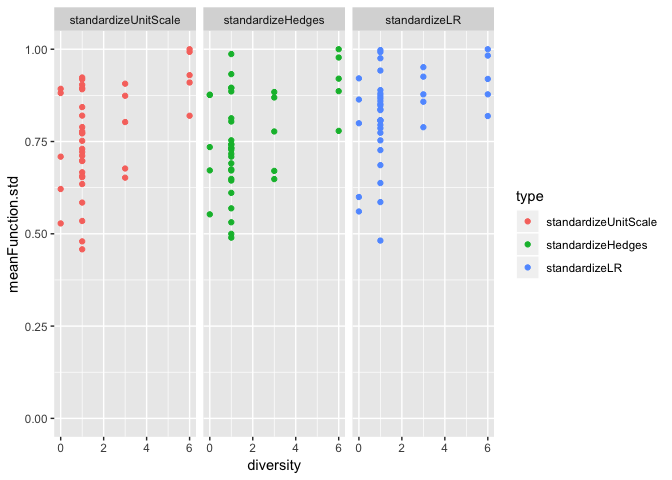
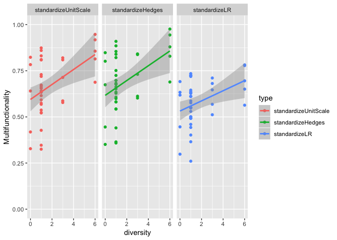
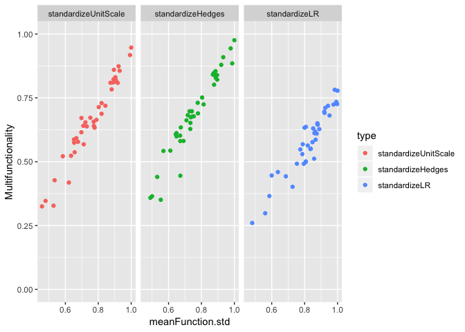

## Standardization Methods

So, in my inimitable wisdom, I actually built a flexible standardization format into the multifunc library. There is one standardization function that handles all of the data manipulation, but calls different standardizing functions. 

Note, this goes with the usual caveat that I want to rewrite the whole thing using tidy principles one day, but that is neither here nor there.

Now, the default is to put everything on the unit scale. And as we've outlined, we take functions with negative values, and bump them until their lowest value is 0. This may not be good, and @FabianRoger has pointed out some big flaws. So, let's explore a few different standardization formats a bit more


```r
library(multifunc)
library(dplyr)
library(ggplot2)


#this is what is in the package now
getStdAndMeanFunctions <- function (data, vars, 
                                    standardizeFunction = standardizeUnitScale,
                                    ...) 
{
    ret <- plyr::colwise(standardizeFunction, ...)(data[, which(names(data) %in% 
        vars)])
    names(ret) <- paste(names(ret), ".std", sep = "")
    ret$meanFunction <- rowSums(ret)/ncol(ret)
    return(ret)
}
standardizeUnitScale <- function (afun, min0 = T, maxValue = max(afun, na.rm = T)) 
{
  if (min0 && min(afun, na.rm = T) < 0) 
    afun <- afun + abs(min(afun, na.rm = T))
  afun/maxValue
}

standardizeZScore <- function (afun) 
  (afun - mean(afun, na.rm = F))/sd(afun, na.rm = T)

#These two are new
standardizeHedges <- function (afun, minFun = min(afun, na.rm=T)) 
  (afun - minFun)/sd(afun, na.rm = T)

standardizeLR <- function (afun, minFun = min(afun, na.rm=T), offset=1)
  log(afun + offset) - log(minFun + offset)
```

The advantage to these later functions is that we can specify a minimum - and it can be 0, if we want! Or, if we use the minimum observed as 0, then we can do so.

Let's play with this a bit using the duffy data. Note, I'm going to flip and move the lower bound to 0 for total algal mass and chl a.


```r
data("duffy_2003")


duffyAllVars <- qw(grazer_mass,wkall_chla,tot_algae_mass,
                  Zost_final_mass,sessile_invert_mass,sediment_C)
duffyAllVars.std <- paste0(duffyAllVars, ".std")

duffy <- duffy_2003 %>%
 dplyr::select(treatment, diversity, one_of(duffyAllVars)) %>%
 dplyr::mutate(wkall_chla = -1*wkall_chla + max(wkall_chla, na.rm=T),
               tot_algae_mass = -1*tot_algae_mass + max(tot_algae_mass, na.rm=T))
```

Now, the standardizations and calculation of functional evenness and multifunctionality. Note, as some standardizations yield max functions > 1, I'm going to rescale to 0 to 1 by dividing by the max.


```r
duffy_std <- rbind(
cbind(duffy, type = "standardizeUnitScale", getStdAndMeanFunctions(duffy, duffyAllVars)),
cbind(duffy, type = "standardizeHedges", getStdAndMeanFunctions(duffy, duffyAllVars, standardizeHedges, minFun=0)),
cbind(duffy, type = "standardizeLR", getStdAndMeanFunctions(duffy, duffyAllVars, standardizeLR))
)

duffy_std <- duffy_std %>%
  mutate(`Functional Evenness` = funcEven(duffy_std, duffyAllVars.std, q=1)) %>%
  group_by(type) %>%
  mutate(Multifunctionality =  `Functional Evenness` * meanFunction/max(meanFunction),
        meanFunction.std = meanFunction/max(meanFunction)) %>%
  ungroup()
```

OK, that done, let's first see if the averages differ much

```r
ggplot(duffy_std,
       aes(x=diversity, y = meanFunction.std , color = type)) +
  geom_point() +
  facet_wrap(~type) +
  ylim(c(0,1))
```

<!-- -->

Eh, somewhat, but not too much from methodology to methodology.  How different are the results?


```r
ggplot(duffy_std,
       aes(x=diversity, y = `Functional Evenness` , color = type)) +
  geom_point() +
  facet_wrap(~type) +
  ylim(c(0,1)) +
  stat_smooth(method="lm")
```

<!-- -->

```r
ggplot(duffy_std,
       aes(x=diversity, y = Multifunctionality , color = type)) +
  geom_point() +
  facet_wrap(~type) +
  ylim(c(0,1)) +
  stat_smooth(method="lm")
```

<!-- -->

There are actually some real differences here, which is nice. Note that MFe, however, is never < 0.5. Now, it could be that functional provisioning is just fairly even across all methods here. Results are broadly similar.


So, how correlated are results with the average. Let's look at both evenness and MF itself (noting that this won't change if we use MFn as it's just a scaling factor)


```r
#correlation with MFa

ggplot(duffy_std,
       aes(x=meanFunction.std, y = Multifunctionality , color = type)) +
  geom_point() +
  facet_wrap(~type) +
  ylim(c(0,1))
```

<!-- -->

```r
duffy_std %>%
  group_by(type) %>%
  summarize(mfe_cor = cor(`Functional Evenness`, meanFunction),
            mf_cor =  cor(Multifunctionality, meanFunction)) %>%
  knitr::kable(digits=3)
```


type                    mfe_cor   mf_cor
---------------------  --------  -------
standardizeUnitScale      0.699    0.977
standardizeHedges         0.602    0.968
standardizeLR             0.633    0.943

Pretty correlated, regardless! I really think this is a product of evenness being constrained by the average - higher average means higher evennes/number of effective functions, regardless. That's why a metric that is the product of two is the only way to go, really.
